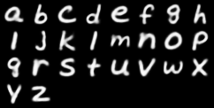

Explore the ability of a neural network to extend the notion of upper/lower case to multiple uppers/lowers and generate a middle case alphabet.
Implemented using VAE and the EMINST data set with Pytorch. 

Examples with latent space size 10 and 500 epochs of training:

Average lower case letters from data set

Upper Case Numbers

Middle Case Figures

**References:**

Original MNIST Code: https://github.com/lyeoni/pytorch-mnist-VAE

MNIST Data set [not used but good package]: https://github.com/hosford42/EMNIST/tree/main

EMINST Data set https://arxiv.org/pdf/1702.05373

Blog Post: https://lackingrigor.wordpress.com/2025/05/29/middle-case/

