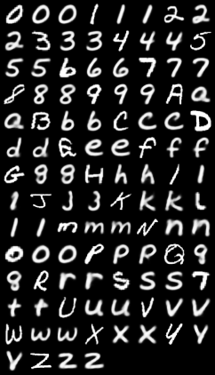

Generate a middle case alphabet using VAE and the EMINST data set with Pytorch.

References:

Original MNIST Code: https://github.com/lyeoni/pytorch-mnist-VAE

MNIST Data set [not used but good package]: https://github.com/hosford42/EMNIST/tree/main

EMINST Data set https://arxiv.org/pdf/1702.05373

Blog Post: https://lackingrigor.wordpress.com/2025/05/29/middle-case/

